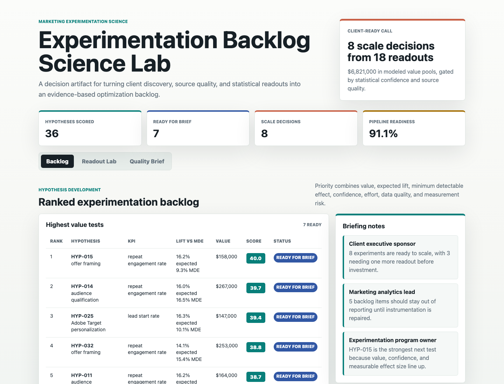
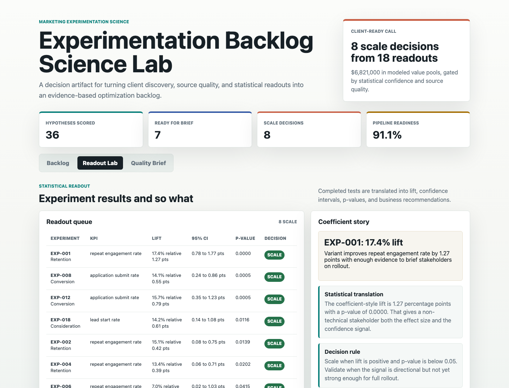
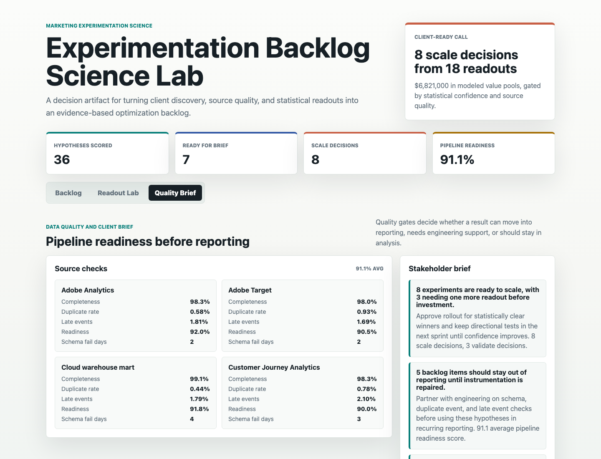

# Experimentation Backlog Science Lab

A portfolio artifact for a data, cloud, and AI consultancy role focused on marketing analytics, experimentation, data quality, and client-ready insight.

The project answers a practical client question:

> Which marketing hypotheses should we test next, which completed tests are statistically trustworthy, and which results are safe to present to stakeholders?

## What this project is

This is a synthetic experimentation science lab, not a static dashboard. It combines:

- A structured hypothesis backlog with KPI alignment, guardrails, minimum detectable effect, expected lift, value pool, effort, data quality, and measurement risk.
- Completed A/B test readouts with conversion counts, relative lift, coefficient-style percentage point lift, confidence intervals, z-scores, p-values, decisions, and business interpretation.
- Source quality checks that decide whether a result is ready for reporting or needs engineering remediation first.
- Client-ready recommendation briefs that explain the so what behind the statistical signal.

## Screenshots



Backlog surface: prioritizes evidence-based hypotheses by value, expected lift, MDE, confidence, effort, data quality, and measurement risk.



Readout surface: translates completed tests into lift, confidence intervals, p-values, coefficient-style effect size, and a scale, validate, stop, or learn decision.



Quality surface: checks analytics and warehouse source readiness before a result moves into stakeholder reporting.

## Data

The datasets are synthetic and generated by `scripts/generate_experimentation_lab.py` with seed `81742`.

Synthetic data was used because real client-level marketing experiment data is not public. The generated structure is modeled on common enterprise marketing analytics workflows:

- Journey-stage hypotheses across healthcare, financial services, higher education, B2C retail, and high-tech contexts.
- Baseline conversion rates by stage, with expected lift sampled from practical optimization ranges.
- Sample sizes large enough for marketing A/B tests, plus minimum detectable effect calculations.
- Treatment and control conversion outcomes used for two-proportion z-tests.
- Source quality checks for analytics, experimentation, journey analytics, and warehouse marts.
- Stakeholder briefs that turn the analysis into business recommendations.

The data does not represent real company or client performance.

## Role Fit

This artifact demonstrates the work expected from a Data Science Analyst in advanced marketing analytics:

- Turning discovery into a structured backlog of testable hypotheses.
- Applying hypothesis testing, confidence intervals, and coefficient-style interpretation.
- Connecting experimental design to business KPIs and guardrails.
- Partnering with data engineering through quality gates before reporting.
- Presenting statistical results in language that non-technical stakeholders can act on.

## Analysis Outputs

- `analysis/analysis_plan.md`
- `analysis/methodology.md`
- `analysis/executive_findings.md`
- `analysis/sql_checks.sql`
- `analysis/outputs/experiment_priority_queue.csv`
- `analysis/outputs/statistical_readouts.csv`
- `analysis/outputs/data_quality_rollup.csv`
- `analysis/outputs/model_summary.json`

## Run Locally

```bash
npm run generate
npm run start
```

Then open `http://localhost:4173`.

## Scope

This project does:

- Generate reproducible synthetic data.
- Score a marketing experimentation backlog.
- Produce statistical readouts from treatment and control outcomes.
- Gate reporting decisions with source quality checks.
- Render a browser-based artifact with three distinct surfaces.

This project does not:

- Use real client data.
- Claim measured business impact for a real company.
- Connect to live Adobe, warehouse, or BI platform APIs.
- Replace a production experimentation platform.
