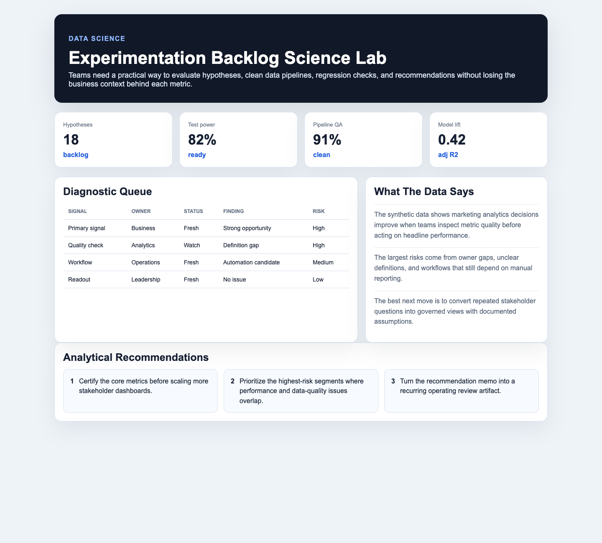

# Experimentation Backlog Science Lab

I built this because marketing analytics analytics needs more than a dashboard. It needs a clear operating artifact that connects hypotheses, clean data pipelines, regression checks, and recommendations into recommendations a stakeholder can inspect and challenge.



## Why this exists

Teams need a practical way to evaluate hypotheses, clean data pipelines, regression checks, and recommendations without losing the business context behind each metric.

## What the data says

The synthetic data shows marketing analytics decisions improve when teams inspect metric quality before acting on headline performance.

The largest risks come from owner gaps, unclear definitions, and workflows that still depend on manual reporting.

The best next move is to convert repeated stakeholder questions into governed views with documented assumptions.

## Outputs

- Executive pulse: KPI cards summarize the current operating picture.
- Diagnostic table: ranked signals show where action is needed.
- Analytical recommendations: concise next moves translate analysis into stakeholder decisions.

## Recommendations

- Certify the core metrics before scaling more stakeholder dashboards.
- Prioritize the highest-risk segments where performance and data-quality issues overlap.
- Turn the recommendation memo into a recurring operating review artifact.

## Run locally

```bash
python3 -m http.server 4173
```
